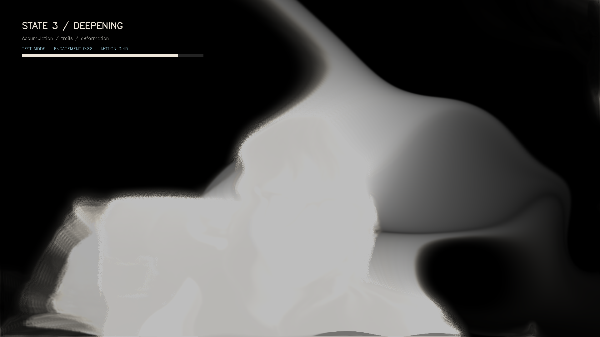
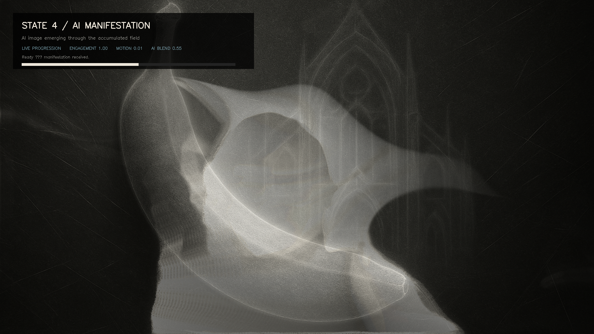
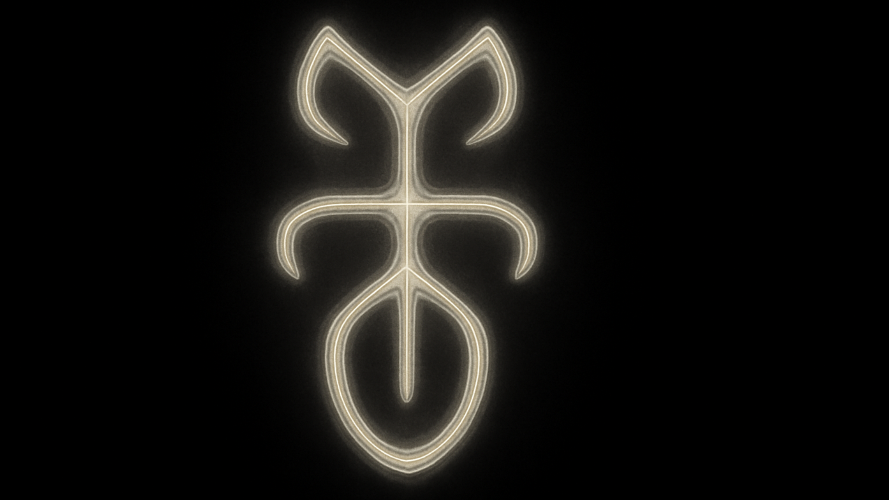
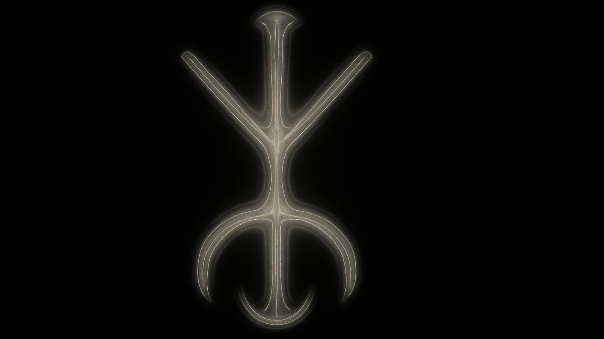
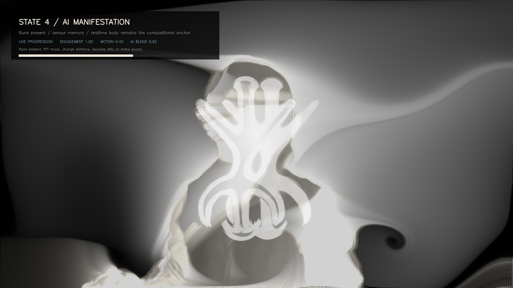

# System Milestones and Rune Generation
**Date:** October 8, 2026  
**Review scope:** Stage One through the current rune-building experience  
**Primary project:** *Attunement / Digital Shrine*  
**Current TouchDesigner build referenced:** `Attunement_Stage1.10.toe`

## Reading the status labels

- **Implemented** — present in the current project or its current supporting scripts.
- **Superseded** — built and tested earlier, then replaced by the current approach.
- **Planned** — discussed as a next direction but not established in the current build.
- **Not documented** — the available files do not support a firmer claim.

## 1. System overview

The experience is a gradual exchange between a participant and a responsive visual environment. The participant contributes four kinds of material: their presence, their movement, the visible scale and location of their body, and the changing energy and frequency balance of sound near the computer. The system turns those contributions into an evolving apparition, a measure of sustained engagement, and eventually an AI-generated rune.

The central premise is that the participant does not issue a command or perform a single correct gesture. They remain with the work. Their continued attention lets the system move from a nearly dormant state into deeper visual transformation. The webcam image is never intended to remain a literal camera view. It becomes a high-contrast, radiographic body field with bloom, trails, contours, grain, refraction, and accumulated visual memory.

The rune is the system's condensed response to that encounter. It is generated from a transformed camera frame plus numerical descriptions of the encounter. The current system treats it as a non-linguistic, invented sigil rather than a readable symbol, logo, copied religious script, or known occult seal. Once returned, the rune does not sit behind the live image as a static backdrop. TouchDesigner reshapes and composites it continuously in relation to the participant's body, motion, distance, and surrounding sound.

The result is therefore two linked outputs:

1. a real-time apparition that reflects the participant's ongoing presence; and
2. a slowly emerging rune whose identity comes from an AI image call and whose continuing behavior comes from native TouchDesigner processing.

The aesthetic is governed by the project's visual reference system: black negative space, warm bone white and cold silver, localized overexposure, radiographic contours, grain, restrained motion, and sparse accent color. The intended feeling is sacred, clinical, ghostly, monumental, and unsettling without becoming a generic glitch effect.

## 2. Milestones and progression

### Stage One — sensing the participant

**Status: Implemented**

Stage One established the sensing foundation. A webcam feed is analyzed locally with Apple Vision person segmentation. The system extracts a person mask and exposes basic measurements such as presence, motion, and body area. The sensing path runs at a lower analysis resolution and rate than the final visual output so that the installation remains responsive.

- **Participant action:** enter the camera view, remain visible, and move naturally.
- **System response:** detect a person, isolate their silhouette, and estimate how much the masked image changes from frame to frame.
- **Inputs:** webcam frames.
- **Core mechanism:** local segmentation, mask coverage, frame difference, exposure-shift correction, and smoothing.
- **Outputs:** presence, motion, body area, an analysis-valid state, and a bone-white silhouette on black.
- **Feeds forward:** these measurements become the control signals for engagement, state progression, image transformation, and later rune behavior.

No cloud service is needed for this sensing stage. The Stage One notes state that sensing frames are passed through in-memory pipes and are not written to disk.

### Stage Two — engagement and ritual progression

**Status: Implemented**

Stage Two changed the experience from direct gesture response into a temporal ritual. The key variable is **engagement**, a continuous value from 0 to 1 that rises during sustained presence and falls after absence. This creates three experiential states:

1. **Dormant** — minimal activity before a person is established.
2. **Attunement** — the system acknowledges and begins responding to sustained presence.
3. **Deepening** — the environment accumulates more visual density, persistence, and deformation.

The current timing is intentionally slow. Engagement rises over roughly 75 seconds, with Deepening beginning around 34 seconds under steady presence. A 12-second absence grace period prevents brief tracking failures from collapsing the ritual, followed by a gradual dissolve.

- **Participant action:** remain with the work; movement is optional rather than required.
- **System response:** accumulate engagement, advance continuously through the states, and decay after disengagement.
- **Inputs:** presence and elapsed time, with motion available as a secondary signal.
- **Core mechanism:** a smoothed accumulator, state thresholds, hysteresis, an absence grace period, and controlled decay.
- **Outputs:** engagement, idle time, and system state.
- **Feeds forward:** engagement scales the intensity of later visual processes and determines when automatic rune generation becomes eligible.

The state changes are not intended to appear as abrupt modes. Thresholds identify phases for development and interface feedback, while the main transformation uses the continuous engagement value.

### Stage Three — the body becomes an apparition

**Status: Implemented; exact Stage Three chronology is not separately documented**

Stage Three transformed the webcam silhouette into the project's visual language. The participant is mirrored and treated as radiographic source material rather than displayed as conventional live video. Thresholding, localized overexposure, sharp and broad bloom, contour extraction, grain, stipple, and liquid refraction produce a luminous apparition.

- **Participant action:** occupy and move through the camera field.
- **System response:** turn the body into a glowing, overexposed, unstable material form.
- **Inputs:** mirrored webcam image, segmentation mask, presence, motion, and engagement.
- **Core mechanism:** masking, luminance shaping, layered blur, edge and contour treatment, animated grain, and spatial distortion.
- **Outputs:** `apparition_out`, an opaque 16:9 body-derived visual field.
- **Feeds forward:** the apparition becomes both the source for feedback memory and the reference image sent to the AI rune generator.

The exact order in which every Stage Three refinement was added is not preserved in a dedicated stage note. The available project scripts and discussion support the behavior above, but not a more precise milestone sequence.

### Stage Four — deepening through visual memory

**Status: Implemented**

Stage Four gave the image memory. The current apparition is combined with a transformed feedback loop that drifts, warps, decays, and accumulates over time. This makes sustained attention visible: earlier traces remain present and slowly reorganize instead of disappearing every frame.

*Stage Four development capture. The participant has reached Deepening, and the HUD exposes engagement and motion while the feedback field stretches the body into a persistent, overexposed form.*

- **Participant action:** stay present, move, pause, or leave.
- **System response:** accumulate trails while engagement is high, deform them with motion, and dissolve them when engagement falls.
- **Inputs:** `apparition_out`, prior feedback, engagement, and motion.
- **Core mechanism:** feedback composition, drift, warp, decay, trail accumulation, and reset at zero engagement.
- **Outputs:** `deepening_out`, a 1920 × 1080 opaque field with persistent body memory.
- **Feeds forward:** this becomes the live environment into which the AI-generated rune is integrated.

A development HUD and stage test mode were added so that Dormant, Attunement, and Deepening could be compared deliberately. These are diagnostic aids rather than separate participant-facing experiences.

### Early Stage Five — direct AI image manifestation

**Status: Superseded**

The first AI manifestation system used manually entered subjects, style presets, and custom prompts. It could send the current apparition frame to OpenAI's image endpoint, receive a generated image, and crossfade it into the TouchDesigner output. This proved the technical connection but made the AI image feel like a static background or an unrelated image layer. A coarse pixelation treatment also obscured the returned subject and covered too much of the scene.

This stage was valuable as a technical proof: TouchDesigner could prepare a reference frame, call `gpt-image-1`, save the returned image, and display it. Its interaction model and visual treatment were replaced because they did not yet express sustained attention or integrate meaningfully with the live body.

*Earlier AI manifestation test. This proved that a generated image could re-enter the TouchDesigner pipeline, while also revealing the need for a clearer symbolic role and stronger integration with the participant.*

The image-loading method also evolved. A direct array-driven image loop produced severe memory use during development. The current implementation uses disk-backed image files, two display slots, and a controlled crossfade.

### Current Stage Five — automatic rune generation

**Status: Implemented**

The AI workflow was reframed around runes. Manual subject and freeform style prompting were removed from the main experience. When presence and engagement conditions are met, the system gathers live encounter data, constructs a descriptive design brief, and sends that brief with the current apparition frame to the OpenAI image-edit endpoint.

| Generated rune example A                                    | Generated rune example B                                    |
| ----------------------------------------------------------- | ----------------------------------------------------------- |
|  |  |

*Two outputs from the current rune image slots. Their shared palette, axial organization, continuous lines, and black negative space maintain family resemblance, while their internal geometry varies between generations.*

- **Participant action:** remain engaged; move or become still; change distance and position; contribute ambient or intentional sound.
- **System response:** interpret the encounter, generate an original rune, crossfade it slowly, and integrate it with the live scene.
- **Inputs:** current apparition frame, presence, engagement, motion, stillness, body area, audio level, audio frequency centroid, recent motion peak, recent audio peak, and selected style controls.
- **Core mechanism:** thresholded automatic triggering, data interpretation, prompt construction, an AI image-edit call, two-slot disk cache, slow crossfade, and a native TouchDesigner material shader.
- **Outputs:** a new rune image, its stored prompt and update metadata, and a continuously animated rune material inside the live field.
- **Feeds forward:** the rune becomes a reusable visual identity for the current encounter while TouchDesigner continues changing its shape in real time.

Automatic generation currently requires AI to be enabled, presence above 0.5, engagement above the configured minimum (default 0.35), the update interval to have elapsed, and no request already running. The default update interval is 120 seconds, with a 30-second minimum; the default visual crossfade is 45 seconds. A manual **Generate Rune Now** control remains for testing and override.

### Current refinement — live rune shapeshifting

**Status: Implemented**

The most recent refinement separates slow AI identity changes from continuous local animation. AI produces a new rune at deliberate intervals. Between calls, TouchDesigner reshapes that rune every frame.

The rune is anchored toward the participant's body center. Body scale changes its expansion, body velocity bends and separates its contours, stillness restores stronger bilateral symmetry, and audio introduces restrained bloom, rings, and filament-like branching. A subtle autonomous breathing motion prevents the rune from becoming a frozen image.

This creates a clearer contract: AI establishes the rune's symbolic material; the live camera and microphone make that material behave as part of the same visual organism as the participant.

*Current rune-building experience captured from `/project1/attunement/prototype_out`. The generated rune remains legible while the participant's silhouette, movement trails, bloom, and live material deformation keep it inside the same visual scene.*

## 3. How data informs rune generation

The current method combines a visual reference with descriptive measurements. The visual reference carries the participant's transformed silhouette. Numerical signals give the AI a compact account of how the encounter is behaving. Style controls constrain the family resemblance between different runes.

| Data source | Ownership | Interpretation or transformation | Role in the descriptive design brief | Effect on the rune |
|---|---|---|---|---|
| Current apparition frame | User-provided image, transformed locally | Mirrored body is segmented, overexposed, contoured, and abstracted | Used as the reference image and described as proportional logic rather than a portrait | Body distribution influences mass, axis, and internal structure without requesting likeness |
| Presence | System-derived from webcam | Person-mask coverage becomes a stable present/absent signal | Controls eligibility for generation; included as encounter context | Prevents rune creation without an established participant |
| Engagement | System-derived over time | Sustained presence accumulates from 0 to 1 | Sets the ritual maturity of the brief and the automatic trigger condition | Later engagement supports a more developed manifestation |
| Motion | System-derived from masked frame difference | Smoothed body change is classified as still, gently opening, or energetic/fractured | Supplies directional and structural language | Ranges from axial symmetry to directional tension and outward fracture |
| Stillness | System-derived as the inverse of motion | High stillness is treated as meditative stability | Reinforces axial or bilateral organization | Encourages symmetry and calm continuity |
| Body area / scale | System-derived from the person mask | Approximate camera proximity and silhouette coverage | Describes the participant's physical occupation of the frame | In live rendering, expands or contracts the rune; prompt influence is present but less explicitly specified |
| Body center and velocity | System-derived locally | Mask centroid and its smoothed movement | Not currently part of the AI request brief | Continuously anchors, bends, and separates the returned rune in TouchDesigner |
| Microphone level | User-provided sound measured locally | RMS energy and recent peak | Becomes quiet/sparse, moderate/rhythmic, or resonant/concentrated language | Changes implied density and luminous-node concentration |
| Audio frequency centroid | System-derived from live audio | Frequency balance becomes low/grounded, balanced/harmonic, or high/filament-like | Supplies material and line-quality language | Biases the rune toward grounded mass, harmonic balance, or fine filaments |
| Rune style preset | Designer/user control | Selects Radiographic Sigil, Liquid Relic, Architectural Glyph, Organic Oracle, or Orbital Seal | Establishes the principal design vocabulary | Keeps a rune within a chosen visual family |
| Symmetry, complexity, erosion, luminosity | Designer/user controls | Numeric constraints are inserted into the brief | Specifies composition, density, surface decay, and brightness | Allows variation without abandoning the shared visual system |
| Camera, motion, and audio influence weights | Designer/user controls | Default weights are approximately 0.78, 0.66, and 0.68 | States the intended importance of each evidence channel | Guides AI emphasis; it is a prompt instruction, not a deterministic mathematical blend |

### What comes from whom

- **User-provided information:** the participant's visible body and the sound reaching the microphone. The current system does not upload or store an audio recording; it analyzes live audio measurements locally.
- **System-derived information:** presence, engagement, motion, stillness, body area, body center, body velocity, audio level, audio peak, and audio centroid.
- **AI interpretation:** the conversion of those measurements and the transformed reference frame into a new visual rune. Because this is a generative image model, identical measurements do not guarantee identical geometry.

Context carries forward in two ways. Engagement summarizes sustained presence across time. Recent motion and audio peaks preserve short windows of intensity that may no longer be present in the latest frame. The current apparition frame carries the accumulated visual treatment of the body into the AI call. After generation, the live data continues to act on the rune through the native shader.

The system does not yet contain a deterministic symbolic grammar in which a particular sound value always maps to a fixed mark. The correlations above are explicit design instructions to the AI and live shader. A more formal rune alphabet or reproducible geometry grammar remains **planned**, not implemented.

## 4. How the machine constructs a descriptive design brief

### Trigger

Brief construction begins when automatic rune generation is enabled and all eligibility conditions are satisfied: a participant is present, engagement has crossed its minimum, the update interval has elapsed, and no image request is already active. A developer can also invoke the same process with **Generate Rune Now**.

### Retrieval and assembly

The manifestation service reads the latest presence, engagement, motion, body area, audio level, audio centroid, and recent peak values. It retrieves the selected rune style and the symmetry, complexity, erosion, luminosity, and influence controls. It captures `apparition_out` as the reference image.

### Interpretation

Continuous measurements are translated into plain design language before the request is sent. The implemented motion interpretation is:

- below 0.18: still, axial, and meditative;
- 0.18 to below 0.48: gently opening with directional tension;
- 0.48 and above: energetic, fractured, and outward-reaching.

The implemented audio-peak interpretation is:

- below 0.12: quiet and sparse;
- 0.12 to below 0.42: breathing with moderate rhythmic density;
- 0.42 and above: resonant with concentrated luminous nodes.

The implemented audio-centroid interpretation is:

- below 0.36: low and grounded;
- 0.36 to below 0.64: balanced and harmonic;
- 0.64 and above: fine, high, and filament-like.

### Actual brief structure

The current brief contains these practical fields, assembled as one prompt string:

1. **Task:** invent one original, non-linguistic rune for a real-time digital shrine.
2. **Reference-use rule:** transform the participant's apparition into proportional and compositional logic rather than a portrait.
3. **Encounter measurements:** presence, engagement, motion, stillness, body area, audio level, audio peak, and audio centroid.
4. **Interpreted qualities:** motion character, sound density, and frequency character.
5. **Style selection:** one of the five rune style families.
6. **Formal controls:** symmetry, complexity, erosion, luminosity, and evidence-channel influence weights.
7. **Visual constraints:** a single centered rune, deep black negative space, bone-white and cold-silver material, continuous contours, internal layers, localized overexposure, restrained grain, and a 16:9 composition.
8. **Exclusions:** no copied alphabet, known occult seal, religious script, logo, word, readable character, or literal portrait.

In the current implementation, the **descriptive design brief and final image-generation prompt are the same artifact**. There is no separately stored structured brief followed by a second prompt-writing model. The assembled brief is sent directly to `gpt-image-1` with the apparition reference image.

### Coherence and variation

Coherence comes from the fixed palette, centered composition, material language, exclusions, and selected style family. Variation comes from the participant's changing frame, live measurements, recent peaks, style selection, and continuous control values. The influence weights communicate intended emphasis, but the image model interprets them semantically; they are not enforced as exact percentages.

### Return, storage, and presentation

The returned image is written into one of two local files, currently `rune_a.png` and `rune_b.png`. TouchDesigner alternates between these slots and slowly crossfades to the new result. The service retains the last prompt, last update time, request status, and a completed-image count for monitoring. The rune is then passed into the material shader, where live body and audio signals keep changing its form.

The two files are an operational display cache. A participant-facing rune archive, named collection, or durable history is **planned / not documented as implemented**.

### Hypothetical worked example

> **This example is illustrative. It is not actual participant data.**

**Available inputs**

- Presence: 1.00
- Engagement: 0.72
- Motion: 0.14
- Stillness: 0.86
- Body area: 0.38
- Audio level: 0.24
- Recent audio peak: 0.35
- Audio centroid: 0.70
- Style: Radiographic Sigil
- Symmetry: high; complexity: medium; erosion: moderate; luminosity: high

**Interpreted meaning**

The encounter is sustained and physically calm. Sound has moderate rhythmic density with a relatively high, filament-like frequency character. The body occupies a stable central area. The rune should feel meditative and axial while allowing fine luminous branches to register the sound.

**Descriptive design brief**

Create one original non-linguistic radiographic rune for a digital shrine. Use the participant's apparition as proportional structure rather than likeness. Build a mostly bilateral, axial form with a stable central mass, continuous bone-white and cold-silver contours, fine high-frequency filaments, moderate erosion, layered internal cavities, and a concentrated overexposed core. Keep deep black negative space. Do not reproduce a known alphabet, religious script, occult seal, logo, word, or readable character.

**Intended rune characteristics**

A calm vertical seal with a luminous center, paired contour wings, and delicate high-frequency branches. During presentation, small participant movements would bend the branches, distance would expand the seal, and live audio would make the luminous nodes breathe.

## 5. System integration

The experience is contained in a TouchDesigner component with controls grouped by sensing, ritual progression, apparition, deepening, testing, manifestation, material, rune system, and rune interaction.

At the application level:

1. the webcam supplies frames to local person analysis;
2. TouchDesigner derives engagement and the live visual field;
3. the microphone supplies live amplitude and spectrum measurements;
4. the manifestation service reads those values and captures the current apparition;
5. the service reads the OpenAI key from a local file or environment variable;
6. it sends the assembled brief and reference frame to the OpenAI image-edit endpoint using `gpt-image-1`;
7. it writes the returned image to one of two local rune files;
8. TouchDesigner reloads the target file and crossfades to it;
9. the AI material shader composites and reshapes the rune inside the feedback environment;
10. the final opaque 1920 × 1080 output is presented through the prototype output.

The AI call is deliberately slow and intermittent. The live sensation comes from TouchDesigner, which operates continuously between calls. This reduces request frequency and keeps the participant's body relevant after the AI image has returned.

The current system stores lightweight operational state: last prompt, last update, request status, completion count, two rune image slots, and the active crossfade state. Long-term session records, a browsable rune collection, and participant-facing provenance are **not documented as implemented**.

## 6. End-to-end experience

1. **Dormant:** the screen is dark and minimally active. The system waits for a person.
2. **Recognition:** local camera analysis finds a participant and establishes presence without displaying conventional webcam footage.
3. **Attunement:** engagement begins to rise. A mirrored, bone-white apparition appears with restrained bloom, grain, and contour movement.
4. **Deepening:** sustained presence builds visual memory. Trails, deformation, density, and persistence make the participant's earlier movement part of the current field.
5. **Rune eligibility:** once presence, engagement, timing, and service conditions are satisfied, the system captures the current apparition and reads the latest motion, body, and audio measurements.
6. **Brief and generation:** the machine interprets those measurements, assembles the descriptive design brief, and sends the brief and apparition reference to the AI image service.
7. **Manifestation:** the returned rune crossfades slowly into the environment. It is rendered as radiographic material within the live scene rather than as a rectangular background image.
8. **Live shapeshifting:** body center, velocity, distance, stillness, audio energy, and audio frequency continue to bend, expand, symmetrize, brighten, and branch the rune.
9. **Renewal:** while the participant remains eligible, another rune can be generated after the update interval, producing a slow, seamless evolution rather than rapid image switching.
10. **Dissolution and return:** after the participant leaves, the grace period and decay return the environment toward Dormant.

The currently supported feedback loop is embodied rather than conversational: the participant changes their position, movement, stillness, distance, and surrounding sound, while designers can adjust the rune style and material controls. A participant-facing approval, revision, naming, saving, or collection-return interface has not yet been implemented.

## Open questions for the next review

- Should a rune represent one continuous session, a fixed time window, or the accumulated history of repeat visits?
- Should the descriptive design brief become a stored structured record separate from the final image prompt?
- Does the project need a deterministic rune grammar so that similar encounters produce visibly related marks?
- How should participants understand camera and microphone use, especially the difference between local measurement and the uploaded apparition reference image?
- What constitutes a completed rune, and how should a participant retrieve or revisit it?
- How should multi-person encounters change the meaning and composition of the rune?
- What performance, API-cost, and failure-state behavior is acceptable for an installation-length run?
